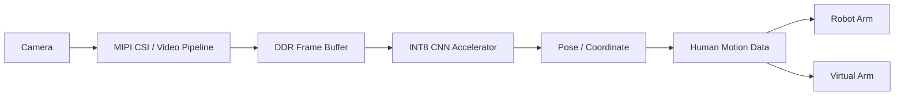
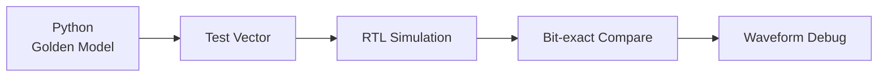
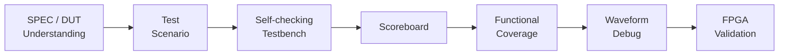

# Han SeungHun

### RTL Design & Verification Engineer

**RTL을 설계하고, Simulation · Coverage · FPGA Validation으로 동작을 증명합니다.**

 

  

[**Portfolio**](https://app.notion.com/p/ace61f2920548207b58d01260d14c80a)
&nbsp;&nbsp;•&nbsp;&nbsp;
[**GitHub**](https://github.com/realisshoon)
&nbsp;&nbsp;•&nbsp;&nbsp;
[**Email**](mailto:hsgn21@naver.com)

---

## 👋 About Me

- **RTL Design · Verification · SoC Integration · FPGA Implementation**을 경험하고 있습니다.
- DUT와 Protocol을 이해한 뒤 **Test Scenario → Scoreboard → Coverage → Waveform Debug**로 동작을 검증합니다.
- 현재는 **Zynq 기반 INT8 CNN Accelerator RTL 설계 및 검증**을 진행하고 있습니다.

> **Target**  
> RTL Verification Engineer / RTL · SoC Design Engineer

---

# 🚀 Current Project

## Zynq CNN Motion Robot SoC

**카메라에서 사람의 움직임을 인식하고 FPGA CNN Accelerator에서 처리한 Human Motion Data로 실제·가상 로봇팔을 제어하는 시스템입니다.**

### My Focus

`CNN Accelerator RTL`
&nbsp; `Golden Model Verification`
&nbsp; `INT8 Datapath`
&nbsp; `System Integration`

| Module | Status | Verification |
|---|:---:|---|
| **Postprocess** | ✅ | Python Golden Model ↔ RTL Bit-exact |
| **Depthwise Conv PE** | ✅ | Directed Vector / RTL Simulation |
| **Pointwise Conv PE** | 🛠 | RTL / Verification 진행 |
| **CNN Top / Dataflow** | 🛠 | Integration 진행 |
| **Zynq System Integration** | 🛠 | PS/PL · AXI/DDR 연동 진행 |

### Verification Strategy

> 진행 중인 프로젝트로, **구현·검증이 완료된 기능과 진행 중인 기능을 구분하여 기록**하고 있습니다.

---

# ⭐ Featured Projects

<table>
<tr>

<td width="50%" valign="top">

### 🎥 FPGA VGA Conductor Game

 

`SystemVerilog` `UVM` `OV7670` `UART`

**OV7670 → RGB Detect → Pattern FSM → BPM/Volume → PC UI**

- RGB Filter / Coordinate Detect Integration
- Top RTL Integration
- RGB Detect UVM
- FPGA ↔ PC UART Integration

 

[**→ View Repository**](https://github.com/realisshoon/fpga-vga-conductor-game)

</td>

<td width="50%" valign="top">

### 🔗 AXI4-Lite Multi-Peripheral SoC

 

`AXI4-Lite` `MicroBlaze` `UVM` `MMIO`

**MicroBlaze + AXI Interconnect + Custom Peripheral**

- UART · Timer · I2C · SPI Integration
- AXI4-Lite Register / MMIO
- Vitis HW/SW Integration
- Basys3 FPGA Validation

**UVM : 32 Pass / 0 Fail · Coverage 100%**

 

[**→ View Repository**](https://github.com/realisshoon/axi4-lite-multi-peripheral-soc)

</td>

</tr>

<tr>

<td width="50%" valign="top">

### 🧪 SPI / I2C RTL & UVM

 

`SystemVerilog` `UVM` `SPI` `I2C`

**Peripheral RTL → UVM → FPGA Board Validation**

- SPI Master / Slave RTL
- UVM Driver · Monitor · Scoreboard
- Functional Coverage
- Board-to-Board Communication

**SPI : 48 Pass / 0 Fail**  
**I2C : 14 Pass / 0 Fail · Coverage 100%** *(Team Result)*

 

[**→ View Repository**](https://github.com/realisshoon/spi_i2c_uvm)

</td>

<td width="50%" valign="top">

### 🧠 RV32I Single-Cycle CPU

 

`SystemVerilog` `RISC-V` `RTL` `Vivado`

**Instruction Fetch → Decode → Execute → Memory → Write-back**

- Datapath
- Control Unit
- Register File
- ALU / Memory Interface
- Branch / JAL / JALR

**Bubble Sort Program Simulation 검증**

 

[**→ View Repository**](https://github.com/realisshoon/RV32i-CPU)

</td>

</tr>
</table>

---

# 🔍 Verification Workflow

### What I Verify

`Protocol Timing`
&nbsp; `Handshake`
&nbsp; `FSM Transition`
&nbsp; `Corner Case`
&nbsp; `Data Integrity`
&nbsp; `Coverage`

---

# 🧩 Additional RTL / Verification Projects

| Project | Core | Result |
|---|---|---|
| [**UART / FIFO OOP Verification**](https://github.com/realisshoon/UART_OOP_Verification) | SystemVerilog OOP · Scoreboard | UART/FIFO Unit + Integration Test |
| [**UART / FIFO / Sensor FPGA System**](https://github.com/realisshoon/UART_FIFO_SENSOR_CLOCK) | UART · FIFO · SR04 · DHT11 | WNS **0.606 ns**, WHS **0.094 ns** |
| [**Stopwatch / Watch RTL**](https://github.com/realisshoon/STOPWATCH-WATCH_Verilog-HDL) | FSM · Datapath · FPGA | Basys3 Implementation |
| [**Jetson Multi-Camera Tracking**](https://github.com/realisshoon/jetson-multicam-re_id-tracking) | Jetson · MQTT · DB | 4-board System Integration |

---

# 🛠 Tech Stack

### HDL / Verification

### SoC / Protocol

### Architecture

### FPGA / Tools

### Programming

---

# 🎯 Current Focus

<table>
<tr>
<td>🧠 <b>INT8 CNN Accelerator</b></td>
<td>RTL Datapath / Control Architecture</td>
</tr>

<tr>
<td>🔬 <b>Bit-exact Verification</b></td>
<td>Python Golden Model ↔ RTL Simulation</td>
</tr>

<tr>
<td>🧪 <b>UVM Verification</b></td>
<td>Scoreboard / Coverage / Corner Case</td>
</tr>

<tr>
<td>🔗 <b>SoC Integration</b></td>
<td>AXI / DDR / PS-PL Integration</td>
</tr>

<tr>
<td>⏱ <b>FPGA Implementation</b></td>
<td>Timing / Resource / Critical Path</td>
</tr>
</table>

---

### 📫 Contact

**Han SeungHun**

[Portfolio](https://app.notion.com/p/ace61f2920548207b58d01260d14c80a)
&nbsp; · &nbsp;
[GitHub](https://github.com/realisshoon)
&nbsp; · &nbsp;
[Email](mailto:hsgn21@naver.com)

 

**RTL Design · Verification · SoC Integration · FPGA**

